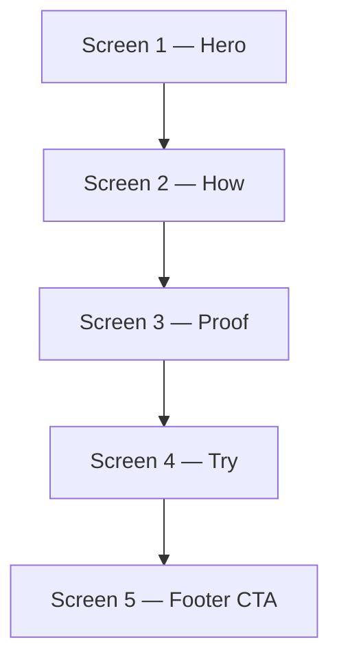

# Falsify Homepage — Design Brief v1 (Option B)

> **Status**: **Approved — implementation authorized** (2026-06-28 · Chris 全过)  
> **Date**: 2026-06-28  
> **Supersedes for implementation**: consolidates `docs/homepage-wireframe-v1.md` IA + `docs/design/*` art direction into one build gate  
> **Sources**: `.vault` 白皮书 v0.2、商业化报告、前端审美报告；repo `docs/homepage-wireframe-v1.md`、`docs/design/*`、`docs/16-homepage-redesign-teardown.md`

---

## Executive summary

Falsify’s homepage today reads like a stacked pitch deck: fourteen sections, seven nav anchors, and a hidden product cockpit. **Option B** collapses the page to **five scroll screens** with one thesis per viewport, a **custom hero visual** (real GitHub Check + product loop — not a lone gate-panel mock), and human copy that sells **judgment on conclusions**, not protocol jargon or code-diff review.

Craft reference is **Pool Money** and **Consensys** (object clarity, world thesis, tactile product surfaces) — **not** their palettes, layouts, or CSS cosplay. Anti-AI rules from the frontend deep-research report apply: token-driven color, no neon-lime-on-black Detail stack, no decorative BLOCK badges, no `tag → h2 → 3-col grid` rhythm.

Chris signed off 2026-06-28 (**Chris 全过**). Implementation authorized; v8/v9 local homepage patches discarded in favor of this brief.

---

## Strategic pivot — ToC skills hero (2026-06-28)

Chris strategic correction (same day, post-v14): the homepage must sell **animation and beauty** — a **ToC skills product** (install skill → adversarial sign-off on your conclusions in Claude Code / BYOK), **not** an enterprise compliance dashboard or merged CI/gate-panel collage.

| Stop | Start |
|------|-------|
| HTML dashboard mock as hero | One **designed scene** (Pool × Jigsaw × Consensys) |
| Gate stages grid, LIVE pills, protocol chrome above fold | Skills hook + one dramatic BLOCK moment |
| Semgrep-style finding snippet / “merge more divs” (v15) | SVG scene + CSS motion; optional video/Lottie in Phase B |
| Contradictory “6/7 PASS — shadow live” in hero | Claim → attack → BLOCK only; full case on Proof screen |

**Hero visual build gate** moves to [`docs/homepage-hero-asset-brief-v1.md`](homepage-hero-asset-brief-v1.md) — motion spec, storyboard, compat-layer strategy, Chris approval checklist. **Do not edit `home.html` for hero** until that brief is approved.

**Unchanged from this doc**: 5-screen IA, headline A, copy tone, anti-AI rules, Try workbench + terminal, pytest compat plan (hidden layer).

---

## Art direction

### North star

**Premium evidence workspace** — a neutral referee’s room where high-risk AI conclusions get attacked before trust. Feels like inspectable product chrome (Pool Money craft), not a compliance PDF, crypto landing, or generic AI SaaS block page.

### What we borrow (craft level only)

| Reference | Take | Do not copy |
|-----------|------|-------------|
| **Pool Money** | Concrete product objects carry meaning; short copy; light, usable surfaces; roles and states feel real | Consumer-fintech tone, emoji use cases, exact layout |
| **Consensys** | One world thesis first; deeper stack later; repeated vocabulary ties sections together | Crypto palette, chain imagery, their stack diagram |
| **Factory.ai** | Designed density in product chrome; KPI/stage strip readability | Full-bleed dark dashboard as entire page |
| **CodeRabbit** | Live external proof link pattern (“judge output yourself”) | Orange accent, PR-review-only positioning |
| **Detail.dev** | Blunt H1, dual CTA, accent discipline | `#090909` + `#b8ff3c` + Inter hero stack |

### Visual identity (Falsify-native)

- **Warm ink + paper** — not pure `#000` / neon green. Use tokens from `docs/design/design-system.md` and `web/static/css/tokens.css` (warm blacks `#050504`–`#11100d`, paper `#f4f1ea`–`#ded6c8`).
- **Product objects, not posters** — claim, attack path, cutline row, verdict, raw artifact. Same object language in hero, How, Proof, Try.
- **Red is earned** — `--critical-red` only for BLOCK severity, failed checks, and Must Fix — not on every chip, tag, or section eyebrow.
- **Tactile surfaces** — thin rules, ≤8px radius, paper cards; no nested shadow stacks or glassmorphism.
- **No competitor cosplay** — if a section could be mistaken for Detail, Semgrep, or a shadcn marketing block, redo it.

### Hero visual (required — not gate-panel alone)

The hero must show **two fused surfaces**:

1. **Real GitHub Check context** — a styled but honest PR/check run surface: job name, pass/fail row, link affordance to sample artifact (not fabricated JSON in a wireframe box). Pattern: CodeRabbit “See a sample review” / Semgrep finding snippet — **evidence, not illustration**.
2. **Product loop strip** — five beats visible in first viewport or immediately below fold line: **Submit → Attack → Cutline → Verdict → Artifact** (simple loop from `docs/design/homepage-story.md`).

The legacy `gate-panel` cockpit may appear **inside** the composite as one panel state, but **cannot** be the only hero asset. Retire `hero-check-img` PNG as primary visual.

**Desktop**: product composite ≥50% viewport width; copy left or stacked per breakpoint.  
**Mobile**: full-bleed product chrome min-height ~280px; CTAs full-width below.

---

## 5-screen information architecture

Nav after rebuild: **How · Proof · Try · Docs · GitHub · 中文** (three anchors + docs + repo + lang).

### Screen 1 — Hero (`#hero`)

| Field | Spec |
|-------|------|
| **Job in 5s** | What Falsify is + show the product moment (verdict under attack), not explain the protocol. |
| **Elements** | Quiet nav · eyebrow (optional) · H1 ≤12 words · sub ≤20 words · dual CTA · **GitHub Check + product loop composite** · one-row trust chips (GitHub · MIT · BYOK · `falsify.review.v1`) |
| **CTAs** | Primary: **Run sample** · Secondary: **Install GitHub Action** |
| **Copy budget** | Hero visible copy ≤40 words · no manifesto paragraphs |
| **Deletes** | PNG-only hero · separate proof-strip · separate trust-band · long protocol subhead |

### Screen 2 — How it decides (`#how`)

| Field | Spec |
|-------|------|
| **Job** | One visual explains Frame → Adversarial → Cutline without essay walls. |
| **Elements** | Optional mono section label · **3-step horizontal strip** (框架审计 · 对抗审查 · Cutline) · verdict row PASS / PASS_WITH_DEBT / BLOCK · link “How adversarial review works →” |
| **Copy budget** | ≤3 × 8-word step labels · **zero** manifesto paragraphs |
| **Note** | Marketing says **框架审计**, not Brooks-Lint. Deeper stack vocabulary lives in docs, not here. |

### Screen 3 — Proof (`#proof`)

| Field | Spec |
|-------|------|
| **Job** | One undeniable BLOCK case + optional founder field note. |
| **Elements** | **One case card** (default: Sharpe 4.06 / mechanic flaw) · finding ≤25 words · link to real artifact file · optional inline Chris Shi quote + avatar |
| **Copy budget** | Case title ≤12 words · quote ≤30 words |
| **Tone** | “Six gates passed… still BLOCK” — judgment failure, not bug hunt. |

### Screen 4 — Try (`#try`)

| Field | Spec |
|-------|------|
| **Job** | Single conversion: feel the verdict OR install in 60s. |
| **Elements** | Workbench (claim + verdict panels, partial-scope disclaimer) · `git clone` terminal block · GitHub Action CTA |
| **Deletes** | `#catches` 6-card bento · `#skills` · separate `#start` |
| **Honesty** | Keep workbench partial-scope disclaimer; do not overclaim hosted enforcement. |

### Screen 5 — Footer CTA

| Field | Spec |
|-------|------|
| **Job** | Final conversion + commercial honesty in one line. |
| **Elements** | Closing h2 ≤10 words · Install · Docs · GitHub · (optional Email) · **one-line** open-core boundary · minimal footer links |
| **Deletes** | `#commercial` grid · `#trust-boundary` duplicate · `#limits` antipatterns · duplicate final-cta vs `#start` |

---

## Copy tone & vocabulary

### Voice

- **Human, direct, high-stakes but usable** — founder-engineer speaking to someone about to ship real money or real decisions.
- **Judgment, not diffs** — Falsify signs off on **conclusions and analysis**, not PR line comments. Never position as “another code review bot.”
- **Neutral referee** — cross-vendor attack survives sycophancy; the page is the room, not a model vendor cheerleading.
- **Evidence-first** — “raw artifact or it didn’t happen”; show inspectable outputs, not claims.

### Say on homepage

| EN | ZH |
|----|-----|
| Adversarial sign-off / review gate | 对抗签署 / 发布闸门 |
| Conclusion / claim / memo / strategy | 结论 / 判断 / 策略 |
| Attack / challenge | 攻击 / 对抗审查 |
| Cutline / Must Fix / Known Debt | 裁刀 / 必须修复 / 已知债务 |
| Verdict: PASS / PASS_WITH_DEBT / BLOCK | 裁决 |
| Raw artifact | 原始证据 |
| Framework review (框架审计) | 框架审计 |

### Do not say on homepage (→ `/docs`)

| Ban from hero/above-fold | Route |
|--------------------------|-------|
| audit channel, meta-layer, semantic verdict nudge | `/docs/07-audit-channel-risks.md` |
| policy-as-code, orchestrator, manifest enforcement gaps | `/docs/10-team-delivery-and-business-model.md` |
| Brooks-Lint, brooks-lint | `/docs/09-brooks-lint.md` |
| Full layers manifesto paragraphs | `/docs/05-adversarial-review.md` |
| `$99` pricing grid, 3-column boundary decks | `/docs/12-open-core-boundary.md` |
| Six-card “what we catch” bento | `/docs/08-examples.md` |

### Bilingual system

- Single content map (`en` / `zh`) per `docs/design/bilingual-copy.md`.
- Founder quote stays **original Chinese** in both modes; sans for quote body, mono for metadata only.
- `document.documentElement.lang` toggles `en` / `zh-CN`.

---

## Anti-AI-smell rules

From `.vault/前端工作流deep-research-report.md` + teardown `[实测]`:

1. **Token-only color** — no ad-hoc hex in templates; all color via CSS variables (`tokens.css` / design-system).
2. **Banned stack** — Inter display + `#090909` + `#b8ff3c` neon lime (Detail cosplay). Display serif (Instrument Serif / Georgia) for EN hero headlines only; Inter/system sans for body, nav, product UI, Chinese.
3. **No BLOCK badge wallpaper** — BLOCK appears as verdict state in product chrome, not repeated decorative stamps, animated seals, or red pills on every section tag.
4. **No default section template** — ban `eyebrow tag + h2 + 3-column card grid` as the page rhythm.
5. **Accent budget ~10%** — green/brand accent on primary CTA + selective pass states; red only for BLOCK/critical. Not on every chip, progress bar, and eyebrow.
6. **One component language** — paper surfaces + mono metadata; do not mix shadcn/marketing blocks with unrelated dashboard skins.
7. **Motion: subtle reveal only** — respect `prefers-reduced-motion`; no scroll-jacking, no flashy red pulse on load.
8. **Objects over adjectives** — if copy says “advanced,” replace with claim/attack/verdict/artifact objects.

---

## Typography, color, motion

### Typography

| Role | Face | Use |
|------|------|-----|
| Display | Instrument Serif, Georgia fallback | Large EN hero headlines only |
| Sans | Inter, SF Pro, Segoe UI, PingFang / Noto SC | Body, nav, buttons, product content, all Chinese |
| Mono | IBM Plex Mono, SF Mono, Consolas | Artifact IDs, check names, metadata, report fields |

Chinese primary headings: **sans**, not mono. Section padding desktop 92–150px; mobile collapsed but breathing.

### Color tokens (canonical)

Use `docs/design/design-system.md` + `web/static/css/tokens.css`:

- **Ink**: `#050504` – `#11100d`
- **Paper**: `#f4f1ea` – `#ded6c8`
- **Text**: `--text-on-dark` / `--text-on-paper` + muted pairs
- **States**: `--critical-red` (BLOCK only) · `--pass-green` (muted) · `--debt-amber`

Red never used for decoration. Green never used as page-wide neon accent.

### Motion

- Reveal on scroll: product loop steps, case card, workbench panels (opacity + translate, 220ms ease-out).
- Hero product composite: static hierarchy first; optional gentle stagger on loop chips only.
- No autoplay video in v1.

---

## Hero headline (approved)

**Approved 2026-06-28** — Chris chose **Option A**.

| | EN | ZH |
|---|---|---|
| **Approved (A)** | Looks right isn't enough. | 看起来对，还不够。 |

Names the Sharpe-class failure: correct facts, wrong conclusion. Wireframe default; use this pair in `bilingual-copy.md` and Screen 1 H1.

### Rejected alternatives (do not implement)

| Option | EN | ZH | Why rejected |
|--------|----|----|--------------|
| **B** | One AI review isn't enough. | 一次 AI 审查还不够。 | Not chosen — clear referee thesis but less specific to judgment failure. |
| **C** | The math passed. The call didn't. | 数字过了，判断没过。 | Not chosen — Sharpe subline energy; may reuse as subline variant only if A subline fails review. |
| **D** | Block weak evidence before it ships. | 弱证据，别上线。 | Not chosen — footer/CTA energy; too action-oriented for hero H1. |
| **E** | A conclusion must survive the attack. | 结论得扛住攻击。 | Not chosen — protocol truth; less human than A. |

**Subline (draft, ≤20w):**  
EN: *Falsify attacks high-risk AI conclusions — then cuts a PASS, debt, or BLOCK before you ship.*  
ZH: *Falsify 攻击高风险 AI 结论，给出 PASS、债务或 BLOCK，再决定是否放行。*

---

## Migration — what moves to `/docs`

| Current homepage burden | Action | Destination |
|-------------------------|--------|-------------|
| `layers_manifesto_*`, meta-layer essay | Move | `/docs/05-adversarial-review.md` |
| Audit-channel risk list | Move | `/docs/07-audit-channel-risks.md` |
| Cases 2–3, artifact JSON panel | Move | `/docs/08-examples.md`, `/examples/sample-block-report.json` |
| `#catches` bento | Delete | Patterns → `/docs/05-adversarial-review.md` |
| `#skills` | Delete | GitHub `skills/` + future `/docs/skills` |
| `#commercial`, `#trust-boundary`, `#limits` | Delete | `/docs/10-*`, `/docs/12-open-core-boundary.md` |
| Full install guide | Move | `/docs/14-github-action-install.md`, `/docs/02-setup.md` |
| i18n target | ~122 keys → **≤45 visible** (+ compat hidden block unchanged for CI) |

Hidden `.compat-public-copy` stays until `tests/test_web.py` Tier 2 migration (see wireframe pytest strategy).

---

## Implementation constraints

- **Do not edit** `web/templates/home.html`, `home.css`, `home.js` until this brief is approved.
- **Discard** local v8/v9 uncommitted homepage patches after approval (`git checkout --` those paths); rebuild Screen 1→5 in one PR.
- **Do not deploy** from this branch until post-approval implementation + verification shots.
- **Tests**: Phase 1 keeps compat hidden div for green CI; Phase 2 updates hero/cockpit assertions per wireframe Tier 2 table.

---

## Chris approval checklist

All signed **2026-06-28 · Chris 全过**:

- [x] **5-screen IA** — Hero → How → Proof → Try → Footer CTA
- [x] **Hero visual** — GitHub Check + product loop composite (not gate-panel alone)
- [x] **Hero headline** — Option A (EN + ZH) · 2026-06-28 · Chris chose A
- [x] **Proof** — one Sharpe case + inline founder quote OK
- [x] **Try** — **workbench + terminal both visible** (not tabbed Local / Action) — Chris default per brief
- [x] **Nav** — three anchors (How · Proof · Try) OK
- [x] **Deletes** — commercial / trust-boundary / limits / skills / catches OK
- [x] **Art direction** — warm ink/paper, no Detail lime stack, no BLOCK badge wallpaper OK
- [x] **Discard v8/v9** local patches after approval OK
- [x] **Brief → code** — authorized to implement `home.html` rebuild

### Try layout decision (recorded)

**Approved default:** Screen 4 shows **workbench and `git clone` terminal side-by-side / stacked** — both always visible. No tab toggle between Local and Action.

### Chris decisions log (2026-06-28)

- **#2 Skills discovery — docs-only:** No homepage `#skills` 4-card grid. Skills discovery via `/docs/17-skills.md` + nav / footer / Try links only.
- **#3 Hero skill strip — keep Cursor:** Visible strip stays **Install skill · Claude Code · Cursor · BYOK** (links to `/docs/17-skills.md`).

---

## Document map (post-approval)

| Doc | Role after brief approved |
|-----|---------------------------|
| **This file** | Build gate + sign-off record |
| `docs/homepage-wireframe-v1.md` | IA wireframe detail + pytest tiers |
| `docs/design/design-system.md` | Token + component spec (implementation reference) |
| `docs/design/bilingual-copy.md` | Copy map source of truth |
| `docs/design/homepage-story.md` | Narrative backup; **8-section story deferred** — homepage ships 5 screens only |
| `docs/design/benchmark-notes.md` | Craft references |
| `docs/design/interaction-spec.md` | **Update nav anchors** to How/Proof/Try when coding starts |
| `docs/16-homepage-redesign-teardown.md` | Historical competitor teardown |

---

## References

- Product truth: `.vault/创作/Falsify 白皮书 v0.1.md` (v0.2)
- Positioning: `.vault/deep-research-report Falsify商业化白皮书.md`
- Anti-AI workflow: `.vault/前端工作流deep-research-report.md`
- Wireframe: `docs/homepage-wireframe-v1.md`
- Teardown: `docs/16-homepage-redesign-teardown.md`
- Marketing PDF: `C:\Users\CHRIS\Desktop\Falsify_营销学白皮书_2026.pdf` — **not ingested** (see blockers)

---

## v1.1 craft refinement (2026-06-28)

Chris review on v12: **structure OK, craft NOT OK**. Five-screen IA unchanged; this pass fixes typography, hero fragmentation, and visual language only.

### Reference synthesis

| Source | Take for v1.1 |
|--------|----------------|
| **Consensys `/products`** | GT America neo-grotesk product voice (we use **Plus Jakarta Sans** on Google Fonts as the closest free adjacent). Strong sans headlines, restrained weight steps, simple geometric motifs (circles/arcs) — not illustration. |
| **Jigsaw.google** | Single focal composition, generous negative space inside product chrome, one shadow / one frame — internal dividers instead of nested card stacks. |

### Hero visual — unified product surface

**Before (v12):** GitHub check row, product loop, and gate-panel rendered as three separate bordered boxes with gaps — fragmented, clumsy splice.

**After (v1.1):** One `.hero-surface` frame with:

1. GitHub check context (top band)
2. Product loop strip (horizontal, hairline vertical dividers — no per-step boxes)
3. `gate-panel.hero-cockpit` (bottom — inherits frame, no second outer border/shadow)

2–3 inline SVG geometric accents (arc, line, dot) sit in `.hero-visual` background at low opacity.

### Typography

| Role | v12 | v1.1 | Rationale |
|------|-----|------|-----------|
| UI / body | Inter | **Plus Jakarta Sans** 400–600 | Consensys-adjacent geometric sans; fixes awkward Inter + serif stack |
| H1 (EN) | Instrument Serif | **Plus Jakarta Sans** 800 | Matches Consensys products headline feel; one family, tight tracking |
| H1 (ZH) | System CJK | unchanged | Existing `--font-zh` rules |
| Mono / schema | IBM Plex Mono | unchanged | Evidence / protocol labels |

### Whitespace & borders

- Hero composite padding increased (~48–72px vertical in visual column)
- One outer shadow on `.hero-surface` only
- Internal sections separated by `border-top: 1px` hairlines
- Removed per-loop-item borders and github-check-row outer border

### Unchanged (test / IA gate)

- Headline A: `Looks right isn't enough.`
- Required DOM: `gate-panel`, `hero-cockpit`, `preview-must-fix`, compat strings, 5-screen order
- Hidden `hero-check-img` for asset route tests

| Item | Status |
|------|--------|
| Marketing PDF | **Unreadable** in agent environment (no PDF library in active Python venv). Brief does not depend on it; ingest manually if headline/marketing tone should align to PDF. |
| Prior subagent `80cf2310` | **Failed** (usage limit) — this brief created by follow-up agent. |
| `docs/design/homepage-story.md` 8-section narrative | **Deferred** — Option B ships 5 screens; deeper archive/use-case library can be Phase 2 or `/docs`. |
