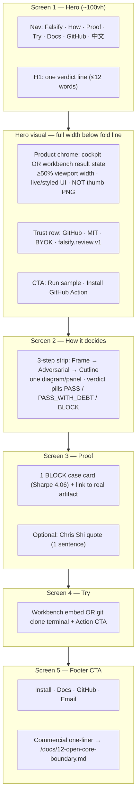
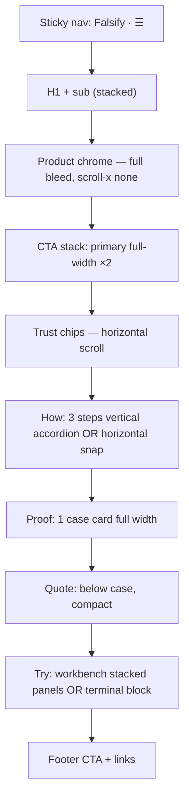

# Falsify Homepage — 5-Screen IA Wireframe v1

> **Status**: Awaiting Chris approval (Option 2 — wireframe before code)  
> **Date**: 2026-06-28  
> **Based on**: Root-cause analysis [cdd97144] + `docs/16-homepage-redesign-teardown.md`  
> **Constraint**: This document only. No `home.html` / `home.css` edits until approved.

---

## Executive summary

Current homepage = **14 content sections**, **7 nav anchors**, **122 i18n keys**, repeated `tag → h2 → grid` deck rhythm. Competitors ship **one idea per viewport** with product chrome as the visual anchor.

**Target**: Collapse to **5 scroll screens** with a single product moment in hero, one proof case, one try surface, one footer CTA row. Everything else migrates to `/docs` or GitHub.

**After approval**: Discard local v8/v9 uncommitted changes (`home.html`, `home.css`, `home.js` product-flow patch) and rebuild from this wireframe — *or* cherry-pick only the product-flow shell concept if hero/catches are cut per this IA.

---

## Root cause (one paragraph)

Falsify feels like PPT because the page model stacks four page types (pitch, demo, install guide, sales deck) into one scroll, repeats the same section skeleton seven times, hides the best UI (`gate-panel` cockpit) in `display:none`, and uses a 420×260 PNG as the only visible product asset. CSS polish cannot fix IA overload [实测: cdd97144].

---

## Scroll map — Desktop (1440px)



### ASCII — Desktop fold hierarchy

```
┌─────────────────────────────────────────────────────────────────────────────┐
│ NAV  Falsify    How · Proof · Try    Docs  GitHub  [中文]                    │
├─────────────────────────────────────────────────────────────────────────────┤
│ SCREEN 1 — HERO                                                              │
│                                                                              │
│  Looks right is not enough.                    ┌──────────────────────────┐ │
│  (≤12w H1)                                     │  COCKPIT / WORKBENCH     │ │
│  One sub-line ≤20w                             │  BLOCK · Frame·Adv·Cut   │ │
│  [Run sample]  [Install Action]                │  Must Fix row visible    │ │
│                                                │  (full-width panel)      │ │
│  GitHub · MIT · BYOK · v1 schema             └──────────────────────────┘ │
├─────────────────────────────────────────────────────────────────────────────┤
│ SCREEN 2 — HOW IT DECIDES                                                    │
│  ┌──────────────┐    ┌──────────────┐    ┌──────────────┐                     │
│  │ 01 Frame     │ →  │ 02 Adversarial│ →  │ 03 Cutline   │  PASS|DEBT|BLOCK │
│  │ 1 line each  │    │ 1 line each   │    │ 1 line each  │                     │
│  └──────────────┘    └──────────────┘    └──────────────┘                     │
│  (Factory-style stage strip — NO manifesto paragraphs)                       │
├─────────────────────────────────────────────────────────────────────────────┤
│ SCREEN 3 — PROOF                                                             │
│  ┌─────────────────────────────────────┐  "Six gates passed…" — Chris Shi    │
│  │ BLOCK · Sharpe 4.06 · mechanic flaw │  (optional, inline not full section)│
│  │ → 01-fictional-horizon-quant…md   │                                     │
│  └─────────────────────────────────────┘                                     │
├─────────────────────────────────────────────────────────────────────────────┤
│ SCREEN 4 — TRY                                                               │
│  ┌─ Claim textarea ─────────┐  ┌─ Verdict output ─────────┐                 │
│  │ Run sample / Quick review  │  │ BLOCK + Must Fix         │                 │
│  └────────────────────────────┘  └──────────────────────────┘                 │
│  — OR —                                                                      │
│  $ git clone … && python falsify.py demo    [Install GitHub Action →]        │
├─────────────────────────────────────────────────────────────────────────────┤
│ SCREEN 5 — FOOTER CTA                                                        │
│  Block weak evidence before it ships.                                        │
│  [Install] [Docs] [GitHub] [Email]                                           │
│  MIT open core · Team path for policy/retention → docs/12-open-core-boundary │
│  Falsify · GitHub · Docs · Sample · License                                  │
└─────────────────────────────────────────────────────────────────────────────┘
```

---

## Scroll map — Mobile (360–390px)



### ASCII — Mobile (single column)

```
┌──────────────────────┐
│ Falsify          [≡] │
├──────────────────────┤
│ H1 (2–3 lines)       │
│ sub (1 line)         │
├──────────────────────┤
│ ┌──────────────────┐ │
│ │ PRODUCT CHROME   │ │  ← min-height 280px
│ │ BLOCK cockpit    │ │
│ └──────────────────┘ │
│ [Run sample    full] │
│ [Install Action full]│
│ ◀ GitHub MIT BYOK ▶  │  ← chip scroll
├──────────────────────┤
│ How it decides       │
│ 01 Frame      ─────  │
│ 02 Adversarial ─────  │
│ 03 Cutline    ─────  │
│ PASS · DEBT · BLOCK  │
├──────────────────────┤
│ PROOF case card      │
│ quote (optional)     │
├──────────────────────┤
│ TRY workbench        │
│ or terminal + CTA    │
├──────────────────────┤
│ Footer CTAs          │
│ commercial 1-liner   │
└──────────────────────┘
```

---

## Per-screen specification

### Screen 1 — Hero

| Field | Spec |
|-------|------|
| **Purpose** | Answer in 5s: what Falsify is + show the product moment (verdict UI), not explain the protocol essay. |
| **Visible elements** | Nav · H1 · one sub-line · dual CTA · **full-width product chrome** (promote `gate-panel` cockpit OR workbench result with BLOCK + stages) · one-row trust chips |
| **Copy budget** | H1 ≤12 words · sub ≤20 words · hero total ≤40 words · no `layers_manifesto` text |
| **Moves to docs** | "Full layers in docs →" stays as link to `/docs/05-adversarial-review.md` · protocol jargon (audit channel, meta-layer) → `/docs/07-audit-channel-risks.md` |
| **Deletes from hero** | `hero-check-img` PNG as sole visual · separate `proof-strip` section · separate `trust-band` section · `hero_definition` long protocol line (shorten to link only) |

**Hero chrome decision** (pick one at implement time):

| Option | Pros | Cons |
|--------|------|------|
| **A — Cockpit** (`gate-panel`) | Already built; shows Frame→Adv→Cutline→BLOCK; matches Factory KPI strip | Currently in `display:none`; needs real visibility + responsive layout |
| **B — Workbench result** | Interactive proof; dev audience | Heavier JS; less "designed panel" polish |

**Wireframe default**: Option A cockpit visible at ≥50% width; workbench remains Screen 4.

---

### Screen 2 — How it decides

| Field | Spec |
|-------|------|
| **Purpose** | One visual explains the 3-layer pipeline without manifesto walls. |
| **Visible elements** | Section label (optional, mono) · **3-step horizontal strip** (Frame Audit · Adversarial Review · Cutline) · verdict row `PASS / PASS_WITH_DEBT / BLOCK` · link "How adversarial review works →" |
| **Copy budget** | ≤3 × 8-word step labels · 0 manifesto paragraphs · 0 duplicate `hero_layers` essay |
| **Moves to docs** | `layers_manifesto_1`, `layers_manifesto_2` → `/docs/05-adversarial-review.md` · meta-layer / cross-vendor independence → `/docs/03-collaboration.md` · audit-channel risks list → `/docs/07-audit-channel-risks.md` |
| **Anchor id** | `#how` (new) or retain `#layers` for redirect compat |

---

### Screen 3 — Proof

| Field | Spec |
|-------|------|
| **Purpose** | One undeniable BLOCK case + optional founder quote; replace 3-case grid + artifact section + standalone quote section. |
| **Visible elements** | **1 case card** (default: Sharpe 4.06 / mechanic flaw) · badge BLOCK · finding ≤25 words · link to real file · optional inline quote + avatar |
| **Copy budget** | Case title ≤12 words · finding ≤25 words · quote ≤30 words |
| **Moves to docs** | Case 2 (fee table), Case 3 (deploy logs) → `/docs/08-examples.md` or GitHub `examples/` · standalone `#artifact` JSON panel → link from case card to `/examples/sample-block-report.json` |
| **Anchor id** | `#proof` (retain existing `proof-strip` id or repurpose) |

---

### Screen 4 — Try

| Field | Spec |
|-------|------|
| **Purpose** | Single conversion surface: feel the verdict OR install in 60s. |
| **Visible elements** | **Primary**: workbench (claim + verdict panels, `workbench_scope` disclaimer) · **Secondary row**: `git clone` terminal block · GitHub Action install CTA |
| **Copy budget** | Section h2 ≤8 words · disclaimer 1 sentence (keep partial-scope copy for honesty) |
| **Moves to docs** | Full install guide → `/docs/14-github-action-install.md` · local setup detail → `/docs/02-setup.md` |
| **Deletes** | `#catches` 6-card bento (entire grid) · `#skills` section · separate `#start` section (merge terminal here) |
| **Anchor id** | `#try` or retain `#demo` |

**Note on v9 product-flow patch**: Local uncommitted change merges catches + demo into `.product-flow`. This wireframe **deletes catches entirely** and keeps only workbench/terminal in Try — so v9 shell is **not** cherry-picked unless Chris wants catches as a collapsed accordion (not recommended).

---

### Screen 5 — Footer CTA

| Field | Spec |
|-------|------|
| **Purpose** | Final conversion + commercial honesty in one line, not a pricing deck. |
| **Visible elements** | Closing h2 ≤10 words · CTA row: Install · Docs · GitHub · (optional Email) · **one-line** open-core/commercial boundary · minimal footer links |
| **Copy budget** | Closing headline ≤10 words · sub ≤20 words · commercial line ≤25 words · **no** 3-column `boundary-grid` |
| **Moves to docs** | `#commercial` full grid → `/docs/10-team-delivery-and-business-model.md` · `#trust-boundary` duplicate grid → `/docs/12-open-core-boundary.md` · `#limits` antipatterns → `/docs/05-adversarial-review.md` FAQ or new `/docs/17-not-falsify.md` |
| **Deletes** | `#commercial`, `#trust-boundary`, `#limits`, duplicate `final-cta` vs `#start` (merge into one) |

---

## Nav — before / after

### Before (7 anchors + Docs + GitHub)

```
Layers · Cases · Sample · Demo · Skills · Docs · GitHub
#layers  #cases  #artifact  #demo  #skills
```

### After (3 anchors + Docs + GitHub)

```
How · Proof · Try · Docs · GitHub
#how   #proof  #try
```

| Old anchor | New target |
|------------|------------|
| `#layers` | `#how` (301 scroll or JS redirect) |
| `#cases` | `#proof` |
| `#artifact` | `#proof` (case link opens JSON) |
| `#demo` | `#try` |
| `#skills` | removed — link from footer to GitHub `skills/` tree |
| `#catches` | removed |
| `#commercial`, `#trust-boundary`, `#limits`, `#start` | removed — docs URLs in footer |

**Mobile nav**: Same 3 anchors + Docs + GitHub + lang toggle. No hamburger mega-menu.

---

## Deletion / migration table

| Current section / id | Action | Destination / notes |
|---------------------|--------|---------------------|
| `header.hero` | **Keep — redesign** | Screen 1; promote cockpit, drop PNG-only hero |
| `hidden` `gate-panel` / `compat-public-copy` | **Keep hidden block** (see pytest strategy) | Cockpit moves to visible hero; compat strings stay in hidden div until tests refactored |
| `#proof` `proof-strip` | **Merge → hero** | Trust metrics become hero chips; drop weak "Try in minutes" stat row |
| `.trust-band` | **Merge → hero** | Chips under hero CTAs |
| `.quote` | **Merge → Screen 3** | Optional inline under case card |
| `#layers` `hero-layers` | **Keep — slim** | Screen 2; strip manifesto paragraphs |
| `.product-flow` / `#catches` | **Delete** | Pattern list → `/docs/05-adversarial-review.md` or `/docs/08-examples.md` |
| `#demo` workbench | **Keep — move** | Screen 4 Try |
| `#skills` | **Delete** | `https://github.com/.../tree/main/skills` + future `/docs/skills` |
| `#cases` (3 cards) | **Merge → 1 card** | Screen 3 Proof; other cases → `/docs/08-examples.md` |
| `#artifact` | **Delete section** | Link from proof case to `/examples/sample-block-report.json` |
| `#commercial` | **Delete** | `/docs/10-team-delivery-and-business-model.md` |
| `#trust-boundary` / `#licensing` | **Delete grid** | One footer line + `/docs/12-open-core-boundary.md` |
| `#limits` | **Delete** | `/docs/05-adversarial-review.md` or dedicated FAQ doc |
| `.final-cta` | **Merge → Screen 5** | Single footer CTA block |
| `#start` terminal | **Merge → Screen 4** | Below workbench or tab toggle "Local / Action" |
| `footer` | **Keep — slim** | Standard links only |

**i18n budget after migration**: ~122 keys → target **≤45 visible keys** (+ compat hidden block unchanged).

---

## pytest / `compat-public-copy` strategy

Tests in `tests/test_web.py` assert DOM structure and copy that **conflicts** with this wireframe. Implementation must plan a **test migration PR** alongside HTML rebuild.

### Tier 1 — Keep via hidden `compat-public-copy` (no test change)

These phrases live in `REQUIRED_PUBLIC_COPY` and `test_web_template_contains_public_product_markers`. **Keep the hidden div** (or equivalent in `serve.PAGE`) until tests explicitly allow relocation to meta/JSON-LD:

- `Review first. Trust after.` / Chinese pairs
- `Frame Audit + Adversarial Review + Cutline.` / `框架审计 · 对抗审查 · Cutline`
- Audit-channel risk phrases (`audit the audit channel itself`, `Prompt-only audit theater`, etc.)
- Cutline terms (`Must Fix`, `Known Debt`, `Delete`, `Verdict`)
- Boundary copy (`Falsify classifies risk…`, `Self-review is not independent review.`)
- `Real backend, not fake analysis.`
- `PASS / PASS_WITH_DEBT / BLOCK`
- Licensing strings (`MIT (core)`, `Self-hosted · unlimited repos`, `hosted policy enforcement`)
- `差一个机制就要上实盘` / `one mechanic away from live money`
- `Cutline-only ≠ full Falsify` / `只有 Cutline ≠ 完整 Falsify`
- `Upgrade trigger:` / `升级触发：`

### Tier 2 — Update tests when implementing wireframe

| Test | Current assertion | Wireframe action |
|------|-------------------|------------------|
| `test_homepage_hero_redesign` | `hero-check-img`, `proof-strip`, `trust-band`, `workbench-panel` in page | Assert visible `gate-panel` in hero; drop PNG-primary assertion |
| `test_homepage_hero_layers_section` | Order: trust-band < quote < layers < demo < artifact | New order: hero < how < proof < try |
| `test_homepage_limits_section` | `id="limits"`, `limits-grid` | Move strings to compat block or docs; **delete test** or assert in `/docs` route |
| `test_homepage_case_card_links` | 3 `case-card` articles | Assert 1 case + links still in PAGE (compat or visible) |
| `test_homepage_open_core_licensing_footer` | `id="licensing"`, full paragraph | Footer one-liner + compat block |
| `test_homepage_proof_strip_github` | `proof-strip`, 3-col grid CSS | Hero trust row replaces strip |
| `test_homepage_hero_image_first` | PNG in hero-visual, cockpit NOT in hero-visual | **Invert**: cockpit in hero-visual, PNG deprecated |
| `test_homepage_layers_strip` | `layers-strip`, no manifesto keys removed | Keep strip; drop manifesto from visible (keys can remain in i18n unused) |

### Tier 3 — Unchanged

- `test_i18n_keys_exist_in_english_and_chinese` — remove unused keys in cleanup pass or keep keys with hidden/compat usage
- `test_homepage_quote_attribution_and_avatar` — quote moves inline to Proof; keep Chris Shi attribution rules
- `test_homepage_workbench_partial_scope_copy` — workbench stays on Try screen
- `test_homepage_block_stamp_animation`, social meta, static assets, zh typography — unchanged

**Recommended approach**: Phase 1 rebuild keeps `.compat-public-copy` hidden div verbatim for green CI; Phase 2 refactors tests to allow phrases in `<meta>` + docs-only.

---

## Design rules (from teardown — still apply)

1. **Accent discipline**: green on primary CTA + BLOCK severity only; not on every chip.
2. **No new section templates**: ban `tag + h2 + 3-col grid` as default pattern.
3. **Product chrome ≥50% viewport width** on desktop hero.
4. **No** `$99` grid, **no** duplicate boundary grids, **no** 6-card bento on homepage.
5. Marketing says **框架审计**, not Brooks-Lint.

---

## Local v8/v9 uncommitted changes — disposition

| Change | Verdict after wireframe approval |
|--------|----------------------------------|
| v8 screenshots / capture-report | Keep for historical reference only |
| v9 `.product-flow` (catches + demo merge) | **Discard** — catches deleted in this IA; merge does not survive |
| v8/v9 `home.css` (+467 lines) | **Discard** — rebuild CSS from 5-screen structure |
| v9 `home.js` (+4 lines) | **Discard** unless unrelated bugfix (review diff) |
| Competitor study screenshots | Keep in `.verification-shots/competitor-study/` |

**Workflow**: `git checkout -- web/templates/home.html web/static/css/home.css web/static/js/home.js` after Chris approves this wireframe, then implement Screen 1→5 in one focused PR.

**Cherry-pick exception**: If Chris wants catches as a **collapsed** "What we catch" drawer inside Try, extract only `.product-shell` CSS patterns — not the full v9 HTML.

---

## Approval checklist (Chris)

- [ ] 5 screens — agree / adjust screen count
- [ ] Hero chrome — cockpit **A** vs workbench result **B**
- [ ] Proof — 1 case (Sharpe) OK; quote inline OK?
- [ ] Try — workbench + terminal both visible, or tabbed?
- [ ] Nav — 3 anchors OK?
- [ ] Delete commercial/trust-boundary/limits/skills/catches — OK?
- [ ] Discard v8/v9 local patches after approval — OK?

---

## References

- Root-cause analysis: agent transcript `cdd97144` (2026-06-28)
- Teardown spec: `docs/16-homepage-redesign-teardown.md`
- Open-core boundary (footer link target): `docs/12-open-core-boundary.md`
- Adversarial review (how-it-decides link): `docs/05-adversarial-review.md`
- GitHub Action install: `docs/14-github-action-install.md`
- Examples (migrated cases): `docs/08-examples.md`
- Current source: `web/templates/home.html` (14 sections, pre-approval)
